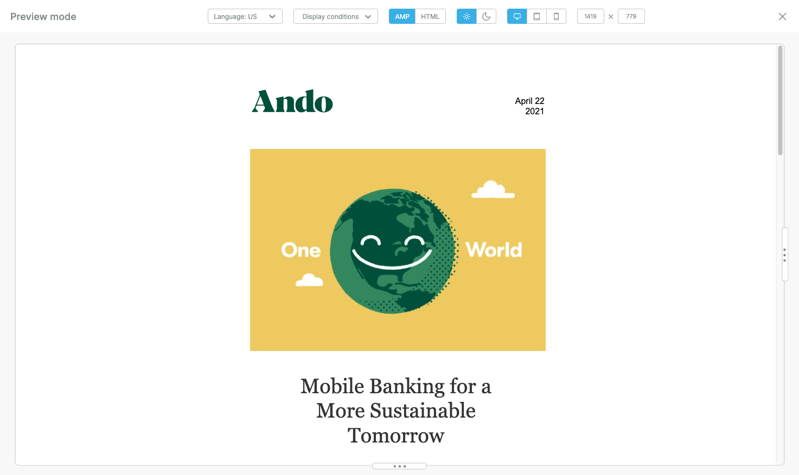

# Preview Designs

Use the Preview option to experience your design as your audience would. It lets you test and interact with different versions of your content before finalizing and sending it.

With Preview, you can:

* View your design in multiple languages
* Apply and test different conditions (for example, dynamic content blocks)
* Switch between AMP and HTML formats
* Toggle between light mode and dark mode
* See how your design looks on various device types (mobile, tablet, desktop)
* Use custom viewports to simulate specific screen sizes

This ensures your content is polished, accessible, and works perfectly for every recipient.

<figure><figcaption></figcaption></figure>

#### Preview Functionality

Through the preview option, you can view how your design will look when coupled with the following features:

* [Multi-language templates](../design-for-any-language/multi-language-templates.md): Applicable when you have one design available in multiple languages.
* [Display conditions](../dynamic-content/display-conditions.md): Applicable when you have one or more rows in your design with display conditions applied.
* [AMP or HTML view](broken-reference): This option is available when you have AMP in your email designs.
* [Dark mode](dark-mode-preview.md): Preview your design in dark mode.
* [Desktop, tablet, or mobile view](mobile-design-mode.md): Preview your design on multiple device types.
* **Custom viewport**: Customize the viewport window size for previewing your design within different window types.&#x20;
