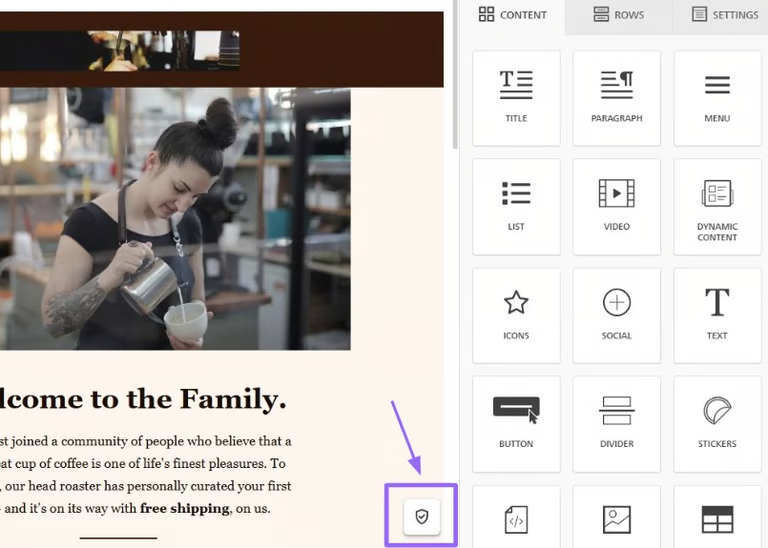

# Quality Check

Quality Check is a built-in tool that reviews your email or page before you send or publish it. It checks things like accessibility, image size, and missing links so you can catch and fix problems directly inside the editor.

### Why it's worth running

Content that's readable, fast to load, and free of broken links has a huge impact on both accessibility and campaign performance.

Running Quality Check before you send or publish helps you:

* **Skip manual work**: Stop investing precious time in lengthy manual QA workflows. One click and you are presented with all things that need fixing.&#x20;
* **Ensure Accessibility**: Alt text, proper headings, and readable color contrast mean more of your recipients, including anyone using a screen reader, can actually engage with what you send.
* **Drive campaign performance**: Right-sized images and a lean email size mean your content loads quickly, even on a slow connection or an older device, and shows up fully in the inbox.
* **Skip the guesswork**: You get a clear, built-in check before you hit send. No separate tool, and no need to rely on a second reviewer to catch the basics.

### How to use Quality Check

Look for the shield icon in the editor’s stage. Click it to run the Quality Check and open the dedicated panel.

#### Understanding your results

Once the check runs, your results are grouped into three sections:

**Warnings** are issues worth fixing before you send or publish: things like a missing image description or a button with no link attached.

**Suggestions** are smaller, optional improvements – nice to have, but not critical.

**Passed** shows everything that's already in good shape, so you know what you don't need to touch.

Each section shows a number next to it. That's the count of individual issues found, so if three images are missing alt text, you'll see a badge with a `3` next to that check.

#### Fixing an issue

Click any result to jump straight to it, as Quality Check highlights the exact element on your canvas so you don't have to go hunting for it.

From there, click the arrow next to the result to open the right editing panel and make the fix on the spot. If you're reviewing a design rather than editing it, clicking a result opens a comment instead, where you can flag the issue for whoever's building it.

### What Quality Check looks at


The exact list of checks and limits may differ slightly from what's listed here, depending on how the integrator has configured Quality Check.


**Accessibility**. Flags issues related to missing alt text, missing main language, missing (or too many) headings, text that's hard to read against its background (low color contrast), and font sizes that may be too small. These checks follow standard web accessibility guidelines, so fixing them helps make sure your emails and pages are usable and readable for everyone.

**Links**. Flags buttons, social icons, images, or menu items that don't have a link attached yet. Missing links have a negative impact on your campaign performance and recipients’ experience.

**Image size & HTML weight**. Signals images and HTML that are larger than the recommended limit (500 KB by default for emails, 700 KB for pages, and 80 KB for HTML). Heavy images and HTML slow down load times and can hurt the experience for your recipients, especially on mobile. Oversized emails also risk being cut off ("clipped") by some inboxes.

**Content details**. Flags missing details such as your email's subject line and preheader, or a page's title and description — small things that affect how your email looks in an inbox, or how your page shows up in search results.

\
 
